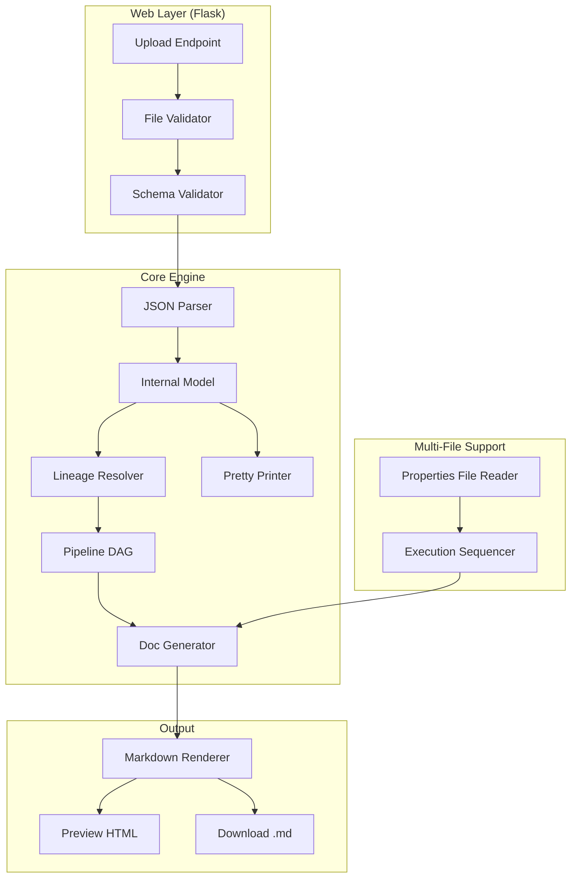

# Design Document: JSON Doc Generator

## Overview

The JSON Doc Generator is a Python web application that accepts ETL pipeline configuration JSON files, parses their structure into an internal representation, resolves data lineage across transformations, and generates human-readable Markdown documentation. The application supports multi-file uploads across domain folders (finance, hr, marketing, sales, supply_chain), handles execution sequencing via properties files, and produces consolidated documentation with lineage tracing from source to target.

The system is built around three core responsibilities:
1. **Parsing** — Deserializing Pipeline_JSON files into a typed internal model
2. **Lineage Resolution** — Building a directed acyclic graph (DAG) of dataframe dependencies
3. **Documentation Generation** — Rendering the internal model as structured Markdown with lineage diagrams

Technology stack: Python 3.11+, Flask (web framework), dataclasses (internal models), and Jinja2 (Markdown templating).

## Architecture



The architecture follows a pipeline pattern:

1. **Web Layer** — Handles file upload, extension validation, and schema validation
2. **Parser** — Converts raw JSON dicts into typed dataclass instances
3. **Lineage Resolver** — Walks the derivedDfPipeline graph to build source→target dependency chains
4. **Doc Generator** — Consumes the internal model + DAG to produce Markdown sections
5. **Pretty Printer** — Serializes the internal model back to Pipeline_JSON format for round-trip verification

### Key Design Decisions

- **Dataclasses over Pydantic**: The JSON schema is fixed and well-understood. Dataclasses provide sufficient typing without the overhead of a validation library. Schema validation is handled separately at the upload boundary.
- **DAG-based lineage**: Transformations form a DAG. Topological sort gives us dependency order for documentation and cross-pipeline lineage detection.
- **Jinja2 for Markdown**: Templates allow non-developers to adjust documentation format without touching Python logic.
- **Flask minimal**: The web layer is thin — upload, validate, generate, serve. No database, no auth, no sessions.

## Components and Interfaces

### 1. File Validator (`validator.py`)

```python
def validate_extension(filename: str) -> bool
def validate_schema(data: dict) -> list[str]  # returns list of error messages
```

Checks:
- File has `.json` extension
- Top-level keys match expected Pipeline_JSON sections
- Required sections present: `sourceDfPipeline`, `derivedDfPipeline`, `outputDfPipeline`
- Each section's entries have required fields (ID, Options)

### 2. JSON Parser (`parser.py`)

```python
def parse_pipeline(data: dict) -> PipelineModel
```

Responsible for:
- Extracting variables from `variablesMP`
- Extracting connections from `connectionDetailsMP`
- Extracting source dataframes from `sourceDfPipeline` + `srcDFsOptionsMP`
- Extracting derived dataframes from `derivedDfPipeline` + `derivedDfPipelineMappingMP` + `derivedDfPipelineMapSrcMap` + `derivedDfPipelineJoiSrcMap`
- Extracting outputs from `outputDfPipeline` + `tgtDFsMP` + `tgtDFsOptionsMP`
- Resolving ID cross-references (e.g., source numeric ID → srcDFsOptionsMP entry)
- Parsing column mapping expressions: `col(source.column).alias(name)`, `expr(...)`, `LITERAL(value)`

### 3. Pretty Printer (`pretty_printer.py`)

```python
def print_pipeline(model: PipelineModel) -> dict
```

Serializes the internal `PipelineModel` back to a valid Pipeline_JSON dict. Used for round-trip verification.

### 4. Lineage Resolver (`lineage.py`)

```python
def resolve_lineage(model: PipelineModel) -> LineageDAG
def resolve_cross_pipeline_lineage(models: list[PipelineModel]) -> list[CrossPipelineLink]
```

Builds a DAG where:
- Nodes are dataframe IDs (source, derived, or output)
- Edges represent data flow (source → derived, derived → derived, derived → output)
- Cross-pipeline links connect output targets of one pipeline to source tables of another

### 5. Doc Generator (`doc_generator.py`)

```python
def generate_documentation(models: list[PipelineModel], sequence: dict[str, list[str]]) -> str
```

Produces consolidated Markdown using Jinja2 templates. Sections:
- Table of Contents (multi-file)
- Per-pipeline: Job Overview, Connections, Sources, Transformations, Lineage, Outputs, Variable Usage
- Cross-pipeline summary

### 6. Properties File Reader (`properties_reader.py`)

```python
def read_properties(domain_folder: str) -> list[str]  # ordered list of filenames
```

Reads a properties file from a domain folder to determine execution sequence.

### 7. Variable Resolver (`variable_resolver.py`)

```python
def find_variable_references(model: PipelineModel) -> dict[str, list[str]]
def find_unresolved_variables(model: PipelineModel) -> list[str]
```

Scans all queries and expressions for `${variable_name}` patterns and builds a cross-reference map.

### 8. Web App (`app.py`)

Flask application with routes:
- `POST /upload` — Accept JSON files, validate, parse, generate docs
- `GET /preview` — Render Markdown as HTML
- `GET /download` — Serve generated Markdown file

## Data Models

### Core Internal Representation

```python
from dataclasses import dataclass, field
from enum import Enum
from typing import Optional

class SourceType(Enum):
    JDBC = "jdbc"
    HIVE = "hive"
    PARQUET = "parquet"

class TransformationType(Enum):
    MAP = "map"
    JOIN = "join"
    UNION = "union"
    AGG = "agg"

class JoinType(Enum):
    INNER = "inner"
    LEFT = "left"

class DatabaseType(Enum):
    ORACLE = "oracle"
    MYSQL = "mysql"
    HIVE = "hive"
    PARQUET = "parquet"

class OutputFormat(Enum):
    JDBC = "jdbc"
    PARQUET = "parquet"

@dataclass
class Variable:
    key: str
    value: str | int | float

@dataclass
class JobInfo:
    job_id: str
    variables: list[Variable]

@dataclass
class Connection:
    id: int
    driver: str
    url: str
    user: str
    password: str
    database_type: DatabaseType  # derived from driver string

@dataclass
class ColumnMapping:
    """Represents a single column mapping entry."""
    source_df: Optional[str]       # e.g., "oracle_stock_df"
    source_column: Optional[str]   # e.g., "warehouse_id"
    alias: str                     # output column name
    expression: Optional[str]      # raw expression if expr() type
    is_literal: bool = False       # True if LITERAL(value) syntax
    literal_value: Optional[str] = None

@dataclass
class SourceDataframe:
    id: str                        # e.g., "oracle_stock_df"
    source_type: SourceType
    connection_id: int
    source_options_id: int         # numeric prefix from srcDFsOptionsMP
    query: Optional[str] = None
    dbtable: Optional[str] = None
    path: Optional[str] = None
    source_filter: Optional[str] = None

@dataclass
class DerivedDataframe:
    id: str
    transformation_type: TransformationType
    # For map type
    source: Optional[str] = None           # from derivedDfPipelineMapSrcMap
    columns: list[ColumnMapping] = field(default_factory=list)
    src_filter: list[str] = field(default_factory=list)
    # For join type
    join_type: Optional[JoinType] = None
    source_a: Optional[str] = None
    source_b: Optional[str] = None
    join_expressions: list[str] = field(default_factory=list)      # AND conditions
    join_expressions_or: list[str] = field(default_factory=list)   # OR conditions
    src_a_filter: list[str] = field(default_factory=list)
    src_b_filter: list[str] = field(default_factory=list)
    # For union type
    source_a_columns: list[ColumnMapping] = field(default_factory=list)
    source_b_columns: list[ColumnMapping] = field(default_factory=list)
    # For agg type
    group_by: list[str] = field(default_factory=list)
    aggregations: list[str] = field(default_factory=list)
    sort: list[str] = field(default_factory=list)

@dataclass
class OutputTarget:
    dataframe_id: str              # which derived df feeds this output
    output_format: OutputFormat
    connection_id: int
    target_id: int                 # numeric target reference
    table_name: Optional[str] = None
    path: Optional[str] = None
    mode: Optional[str] = None
    batchsize: Optional[int] = None

@dataclass
class PipelineModel:
    """Complete internal representation of a single Pipeline_JSON file."""
    filename: str
    domain: Optional[str] = None
    job: Optional[JobInfo] = None
    connections: list[Connection] = field(default_factory=list)
    sources: list[SourceDataframe] = field(default_factory=list)
    derived: list[DerivedDataframe] = field(default_factory=list)
    outputs: list[OutputTarget] = field(default_factory=list)
```

### Lineage DAG Model

```python
@dataclass
class LineageNode:
    id: str
    node_type: str  # "source", "derived", "output"
    label: str      # human-readable description

@dataclass
class LineageEdge:
    from_id: str
    to_id: str
    relationship: str  # "feeds", "joins_with", "unions_with"

@dataclass
class LineageDAG:
    nodes: list[LineageNode]
    edges: list[LineageEdge]

    def topological_order(self) -> list[str]:
        """Returns node IDs in dependency order."""
        ...

    def trace_to_sources(self, output_id: str) -> list[list[str]]:
        """Returns all paths from an output back to source nodes."""
        ...

@dataclass
class CrossPipelineLink:
    source_pipeline: str       # filename
    source_output_table: str   # output table name
    target_pipeline: str       # filename
    target_source_query: str   # source query referencing the table
```

### Expression Parsing

Column mapping entries follow these patterns:
- `col(source_df.column_name).alias(alias_name)` — direct column reference
- `expr(...).alias(alias_name)` — computed expression
- `LITERAL(value)` within expr — constant value
- `col(column_name)` without source prefix — used in groupBy/sort contexts
- `col(column_name).desc()` — descending sort

The parser uses regex to extract these components:

```python
COL_PATTERN = r"col\((?:(\w+)\.)?(\w+)\)(?:\.alias\((\w+)\))?(?:\.desc\(\))?"
EXPR_PATTERN = r"expr\((.+)\)(?:\.alias\((\w+)\))?"
LITERAL_PATTERN = r"LITERAL\(([^)]+)\)"
VARIABLE_PATTERN = r"\$\{(\w+)\}"
```

### ID Cross-Reference Resolution

The JSON schema uses numeric IDs to link sections:
- `sourceDfPipeline[].Options.source` (e.g., `800800801`) → `srcDFsOptionsMP[].ID` (e.g., `"800800801.OPTIONS"`)
- `outputDfPipeline[].Options.target` (e.g., `4008001`) → `tgtDFsMP[].ID` (e.g., `"4008001.FORMAT"`, `"4008001.TABLE"`)
- `outputDfPipeline[].Options.connection` → `connectionDetailsMP[].ID`
- `derivedDfPipelineMappingMP[].ID` suffixes: `.srcFilter`, `.joinExpression`, `.joinExpressionOR`, `.srcAFilter`, `.srcBFilter`, `.groupBy`, `.agg`, `.sort`, `.sourceA`, `.sourceB`


## Correctness Properties

*A property is a characteristic or behavior that should hold true across all valid executions of a system — essentially, a formal statement about what the system should do. Properties serve as the bridge between human-readable specifications and machine-verifiable correctness guarantees.*

### Property 1: Parse/Print Round-Trip

*For any* valid Pipeline_JSON file, parsing it into a PipelineModel and then printing it back to JSON and parsing again SHALL produce an equivalent PipelineModel. That is: `parse(print(parse(json))) == parse(json)`.

**Validates: Requirements 2.1, 2.2, 2.3, 2.4, 2.5, 2.6, 2.7, 2.8, 2.9, 2.10, 2.11, 2.12, 2.13, 2.14, 2.15, 3.1, 3.2**

### Property 2: File Extension Validation

*For any* filename string, the extension validator SHALL accept it if and only if the filename ends with `.json` (case-insensitive).

**Validates: Requirements 1.2**

### Property 3: Schema Validation Error Identification

*For any* JSON dict that is missing one or more required Pipeline_JSON sections, the schema validator SHALL return an error list that contains the filename and identifies each missing or malformed section by name.

**Validates: Requirements 1.3, 1.4**

### Property 4: Password Masking

*For any* PipelineModel containing connections with non-empty password values, the generated documentation SHALL never contain any of those password values as literal text, and SHALL contain asterisk characters in their place.

**Validates: Requirements 5.4**

### Property 5: Job Overview Documentation Completeness

*For any* PipelineModel with a job ID and a set of variables, the generated documentation SHALL contain the job ID, and for each variable, both its key and its value SHALL appear in the Job Overview section.

**Validates: Requirements 4.1, 4.2, 4.3**

### Property 6: Connection Documentation Completeness

*For any* PipelineModel with a set of connections, the generated documentation SHALL contain each connection's numeric ID, its derived database type (Oracle/MySQL/Hive), and its URL.

**Validates: Requirements 5.1, 5.2, 5.3**

### Property 7: Source Documentation Completeness

*For any* PipelineModel with source dataframes, the generated documentation SHALL contain each source's ID, and: for JDBC sources the SQL query or dbtable; for Hive sources the query and "Hive" identification; for Parquet sources the file path and any sourceFilter. Each source's connection ID and resolved database type SHALL also appear.

**Validates: Requirements 6.1, 6.2, 6.3, 6.4, 6.5**

### Property 8: Transformation Documentation Completeness

*For any* derived dataframe in a PipelineModel, the generated documentation SHALL contain all of its metadata: for map types — all column mappings, expressions, srcFilter conditions, and LITERAL values; for union types — sourceA, sourceB, and both column mapping sets; for agg types — groupBy columns, aggregation expressions, and sort order; for all types with pre-join filters — srcAFilter and srcBFilter conditions.

**Validates: Requirements 7.1, 7.2, 7.6, 7.7, 7.8, 7.9, 7.11**

### Property 9: Join Documentation Completeness

*For any* join-type derived dataframe, the generated documentation SHALL contain the join type, sourceA, sourceB, and all join expression conditions. When multiple AND conditions exist, all SHALL appear as compound AND. When OR conditions exist, they SHALL appear separately from AND conditions.

**Validates: Requirements 7.3, 7.4, 7.5**

### Property 10: Dependency Order

*For any* PipelineModel, the transformations in the generated documentation SHALL appear in topological dependency order such that for every derived dataframe, all of its source dependencies (whether source dataframes or other derived dataframes) appear earlier in the document.

**Validates: Requirements 7.10**

### Property 11: Lineage Completeness

*For any* PipelineModel, the lineage section SHALL contain all dataframe IDs (source, derived, and output), and for each output dataframe, tracing the dependency chain back through the DAG SHALL terminate exclusively at source dataframe nodes.

**Validates: Requirements 8.1, 8.2**

### Property 12: Output Documentation Completeness

*For any* output target in a PipelineModel, the generated documentation SHALL contain the dataframe ID, and: for JDBC outputs — the table name, format, write mode, and batchsize; for Parquet outputs — the file path, "parquet" format, and write mode. The target connection SHALL also appear.

**Validates: Requirements 9.1, 9.2, 9.3, 9.4**

### Property 13: Multi-Output Indication

*For any* PipelineModel where a single derived dataframe has multiple output targets, the generated documentation SHALL list each target separately and indicate that the same dataframe feeds multiple destinations.

**Validates: Requirements 9.5**

### Property 14: Properties File Ordering

*For any* domain folder with a properties file defining an execution sequence, the generated documentation SHALL present pipelines from that folder in the order specified by the properties file, and each pipeline SHALL display its execution order number.

**Validates: Requirements 10.1, 10.2, 10.3**

### Property 15: Alphabetical Fallback Ordering

*For any* domain folder without a properties file, the generated documentation SHALL order pipelines alphabetically by filename and SHALL include a warning about the missing properties file.

**Validates: Requirements 10.4**

### Property 16: Multi-File Consolidated Documentation

*For any* set of N uploaded Pipeline_JSON files across M domain folders, the generated documentation SHALL contain: a table of contents with all N pipelines grouped by their M domains, N individual pipeline documentation sections, and a summary section where total counts equal the sum of individual pipeline counts.

**Validates: Requirements 11.1, 11.2, 11.3**

### Property 17: Variable Cross-Reference Completeness

*For any* PipelineModel with variables and queries/expressions containing `${variable_name}` references, the generated documentation SHALL list all variables with their default values, and SHALL produce a cross-reference table mapping each variable to every source dataframe and derived dataframe that references it.

**Validates: Requirements 13.1, 13.2, 13.3, 13.4**

### Property 18: Unresolved Variable Warning

*For any* PipelineModel where a `${variable_name}` reference in a query or expression does not match any variable defined in variablesMP, the generated documentation SHALL contain a warning flagging that unresolved variable reference.

**Validates: Requirements 13.5**

## Error Handling

### Upload Errors
- **Invalid extension**: Return 400 with message identifying the filename and expected `.json` extension
- **Invalid JSON syntax**: Return 400 with message identifying the filename and JSON parse error location
- **Schema validation failure**: Return 400 with structured error listing each missing/malformed section per file
- **Empty upload**: Return 400 with message indicating no files were provided

### Parsing Errors
- **Missing cross-reference**: If a `sourceDfPipeline` entry references a connection ID not in `connectionDetailsMP`, log a warning and mark the source as having an unresolved connection
- **Malformed expression**: If a column mapping entry doesn't match `col()` or `expr()` patterns, store it as a raw string and flag it in documentation
- **Duplicate IDs**: If multiple entries share the same ID within a section, use the last occurrence and log a warning

### Lineage Errors
- **Circular dependency**: If the DAG contains a cycle (should not happen in valid pipelines), raise a validation error and report the cycle path
- **Orphan dataframes**: If a derived dataframe references a source that doesn't exist in the pipeline, flag it as an unresolved reference in documentation

### Documentation Generation Errors
- **Missing properties file**: Default to alphabetical ordering and include a warning in the output
- **Template rendering failure**: Return 500 with internal error details logged (not exposed to user)

### Variable Resolution Errors
- **Unresolved variable**: Include a warning section in the generated documentation listing all `${variable_name}` references that don't match defined variables
- **Unused variables**: Optionally note variables defined in `variablesMP` that are never referenced in any query or expression

## Testing Strategy

### Property-Based Testing

Library: **Hypothesis** (Python property-based testing framework)

Each correctness property from the design document will be implemented as a single Hypothesis test with a minimum of 100 examples per run. Tests will use custom strategies to generate valid Pipeline_JSON structures.

Configuration:
```python
from hypothesis import given, settings, HealthCheck
from hypothesis import strategies as st

@settings(max_examples=200, suppress_health_check=[HealthCheck.too_slow])
```

Tag format for each test:
```python
# Feature: json-doc-generator, Property 1: Parse/Print Round-Trip
```

Key strategies to implement:
- `pipeline_json_strategy()` — generates valid Pipeline_JSON dicts with random but structurally correct content
- `source_dataframe_strategy()` — generates source dataframes with valid type/connection/query combinations
- `derived_dataframe_strategy()` — generates derived dataframes with valid transformation metadata
- `column_mapping_strategy()` — generates valid `col()` and `expr()` patterns including LITERAL values
- `variable_strategy()` — generates variable definitions and matching `${var}` references in queries

### Unit Testing

Framework: **pytest**

Unit tests complement property tests by covering:
- Specific examples from the provided JSON files (finance, hr, marketing, sales, supply_chain)
- Edge cases: empty Options arrays, parquet targets without TABLE entries, single-key Options entries (no "value" field)
- Integration tests: full upload→parse→generate→download flow with real JSON files
- Cross-pipeline lineage detection with known matching table names
- Regex parsing edge cases: nested parentheses in expressions, special characters in LITERAL values

### Test Organization

```
tests/
├── test_validator.py          # Extension and schema validation
├── test_parser.py             # Parsing individual sections
├── test_pretty_printer.py     # Round-trip property tests
├── test_lineage.py            # DAG construction and traversal
├── test_doc_generator.py      # Documentation output properties
├── test_variable_resolver.py  # Variable reference detection
├── test_properties_reader.py  # Properties file parsing
├── test_integration.py        # End-to-end with real JSON files
└── strategies.py              # Shared Hypothesis strategies
```
