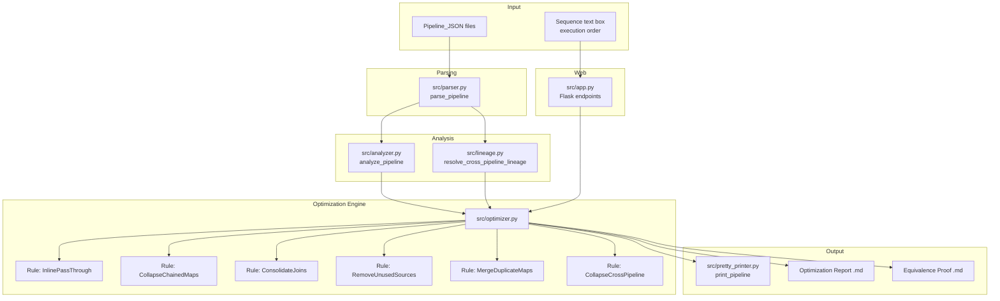

# Design Document: Pipeline Optimizer

## Overview

The Pipeline Optimizer is a transformation engine that takes one or more `PipelineModel` instances (parsed from Pipeline_JSON files), applies a sequence of semantics-preserving optimization rules, and produces reduced, equivalent `PipelineModel` instances. It also generates two supporting Markdown documents: an Optimization Report (before/after summary) and an Equivalence Proof (step-by-step reasoning why the output is semantically identical).

The optimizer operates in two modes:

1. **Single-pipeline mode** — applies intra-pipeline optimizations (inline pass-throughs, collapse chained maps, consolidate joins, remove unused sources, merge duplicate maps).
2. **Cross-pipeline mode** — given an ordered sequence of Pipeline_JSON files, detects where one pipeline's output (parquet/table) feeds another pipeline's source, and collapses the intermediate write-then-read into a direct dataframe connection.

The system integrates with the existing Flask web app via new API endpoints and a "sequence text box" UI element where users paste the execution order of JSON files.

## Architecture



The optimizer is a pure function: `optimize(models, sequence) -> OptimizationResult`. It does not mutate the input models; it produces new model instances. This makes it safe to compare before/after and generate proofs.

## Components and Interfaces

### 1. Optimization Rules (Strategy Pattern)

Each rule is a callable that conforms to a common interface:

```python
@dataclass
class OptimizationStep:
    """Record of a single optimization applied."""
    rule_name: str
    affected_ids: list[str]
    description: str
    before_snapshot: str  # short textual summary
    after_snapshot: str

class OptimizationRule(Protocol):
    """Interface for a single optimization rule."""
    name: str

    def applies(self, model: PipelineModel, recommendations: PipelineRecommendations) -> bool:
        """Return True if this rule can be applied to the model."""
        ...

    def apply(self, model: PipelineModel, recommendations: PipelineRecommendations) -> tuple[PipelineModel, list[OptimizationStep]]:
        """Apply the rule, returning a new model and the steps taken."""
        ...
```

Rules are composed into an ordered pipeline via the orchestrator.

### 2. Cross-Pipeline Optimizer

```python
@dataclass
class CrossPipelineMerge:
    """Record of a cross-pipeline collapse."""
    producer_filename: str
    consumer_filename: str
    intermediate_table: str
    merged_model: PipelineModel
    steps: list[OptimizationStep]

class CrossPipelineOptimizer:
    """Detects and applies cross-pipeline collapses."""

    def detect_merge_candidates(
        self, models: list[PipelineModel], sequence: list[str]
    ) -> list[CrossPipelineMerge]:
        ...

    def merge_pipelines(
        self, producer: PipelineModel, consumer: PipelineModel, link: CrossPipelineLink
    ) -> tuple[PipelineModel, list[OptimizationStep]]:
        ...
```

The merge operation:
1. Identifies the producer's output target (table/parquet path) that matches the consumer's source.
2. Removes the producer's output target entry for that table.
3. Removes the consumer's source dataframe that reads from that table.
4. Connects the producer's final derived dataframe directly as a source reference in the consumer's derived pipeline.
5. Merges connections, variables, and remaining sources/outputs into a single unified `PipelineModel`.

### 3. Optimization Orchestrator

```python
@dataclass
class OptimizationResult:
    """Complete result of optimization."""
    original_models: list[PipelineModel]
    optimized_models: list[PipelineModel]
    steps: list[OptimizationStep]
    cross_pipeline_merges: list[CrossPipelineMerge]
    report_markdown: str
    proof_markdown: str

def optimize(
    models: list[PipelineModel],
    sequence: list[str] | None = None,
) -> OptimizationResult:
    """Main entry point. Applies all optimizations in safe order."""
    ...
```

**Safe ordering of passes:**
1. Remove unused sources (no downstream effects)
2. Inline pass-through maps (simplifies graph for subsequent passes)
3. Collapse chained maps (reduces node count)
4. Consolidate joins (reduces join operations)
5. Merge duplicate maps (final deduplication)
6. Cross-pipeline collapse (only if sequence provided; operates on the already-optimized individual pipelines)

Each pass is applied iteratively until no more changes occur (fixed-point), then the next pass begins. This ensures that an inline in pass 2 might expose a new chain for pass 3.

### 4. Report Generator

```python
def generate_optimization_report(
    original_models: list[PipelineModel],
    optimized_models: list[PipelineModel],
    steps: list[OptimizationStep],
    merges: list[CrossPipelineMerge],
) -> str:
    """Generate Markdown optimization report."""
    ...
```

### 5. Equivalence Proof Generator

```python
@dataclass
class ProofStep:
    """A single step in the equivalence proof."""
    rule_applied: str
    original_fragment: str
    optimized_fragment: str
    reasoning: str  # why this preserves semantics

def generate_equivalence_proof(
    original_models: list[PipelineModel],
    optimized_models: list[PipelineModel],
    steps: list[OptimizationStep],
) -> str:
    """Generate Markdown equivalence proof."""
    ...
```

The proof structure:
1. **Source Equivalence** — same queries, same connections
2. **Transformation Equivalence** — step-by-step mapping from original to optimized
3. **Output Equivalence** — same output columns in same order, same target tables
4. **Rule Justifications** — for each applied rule, a reasoning chain

### 6. Flask Integration

New endpoints added to `src/app.py`:

| Endpoint | Method | Description |
|----------|--------|-------------|
| `/optimize` | POST | Accept JSON files + optional sequence, return optimized JSON |
| `/optimize/preview` | GET | Preview optimization report as HTML |
| `/optimize/download` | GET | Download optimized JSON + report + proof as zip |

The sequence text box is a `<textarea>` in the upload form where users paste filenames (one per line) to declare execution order for cross-pipeline optimization.

### 7. Deep Copy Utility

Since the optimizer must not mutate inputs, a `deep_copy_model(model: PipelineModel) -> PipelineModel` utility creates independent copies of all nested dataclasses before transformation.

## Data Models

### New Models (added to `src/models.py` or `src/optimizer.py`)

```python
@dataclass
class OptimizationStep:
    """Immutable record of one optimization transformation."""
    rule_name: str           # e.g., "inline_pass_through"
    affected_ids: list[str]  # dataframe IDs involved
    description: str         # human-readable explanation
    before_snapshot: str     # textual summary of state before
    after_snapshot: str      # textual summary of state after


@dataclass
class CrossPipelineMerge:
    """Record of merging two pipelines."""
    producer_filename: str
    consumer_filename: str
    intermediate_table: str  # the table/path that was eliminated
    merged_model: PipelineModel
    steps: list[OptimizationStep] = field(default_factory=list)


@dataclass
class OptimizationResult:
    """Complete output of the optimization engine."""
    original_models: list[PipelineModel]
    optimized_models: list[PipelineModel]
    steps: list[OptimizationStep]
    cross_pipeline_merges: list[CrossPipelineMerge]
    report_markdown: str
    proof_markdown: str


@dataclass
class ProofStep:
    """One reasoning step in the equivalence proof."""
    rule_applied: str
    original_fragment: str
    optimized_fragment: str
    reasoning: str
```

### Existing Models Used (unchanged)

- `PipelineModel` — the primary input/output structure
- `DerivedDataframe` — individual transformation steps
- `ColumnMapping` — column-level mapping with source tracking
- `PipelineRecommendations` — output of the analyzer, drives rule selection
- `CrossPipelineLink` — from `src/lineage.py`, identifies inter-pipeline dependencies
- `OutputTarget` — output table/parquet definitions
- `SourceDataframe` — source table/query definitions

### Column Reference Rewriting

When inlining or merging dataframes, column references must be rewritten. The rewriting operates on `ColumnMapping.source_df` and `ColumnMapping.raw`:

```python
def rewrite_column_ref(
    mapping: ColumnMapping,
    old_source_id: str,
    new_source_id: str,
) -> ColumnMapping:
    """Create a new ColumnMapping with source_df replaced."""
    ...
```

This is the atomic operation underlying all structural transformations.


## Correctness Properties

*A property is a characteristic or behavior that should hold true across all valid executions of a system — essentially, a formal statement about what the system should do. Properties serve as the bridge between human-readable specifications and machine-verifiable correctness guarantees.*

### Property 1: Inline pass-through removes node and rewrites references

*For any* valid PipelineModel containing a pass-through map (no filter, no expressions, single consumer), after applying the inline optimization, the pass-through's ID should no longer appear in the derived list AND all column references in the consumer that previously pointed to the pass-through should now point to the pass-through's original source.

**Validates: Requirements 1.1, 1.2**

### Property 2: Inline preserves consumer column order

*For any* valid PipelineModel containing a pass-through map with a single consumer, after inlining, the consumer's column alias list (in order) should be identical to its column alias list before inlining.

**Validates: Requirements 1.3**

### Property 3: Pass-throughs with filters are not inlined

*For any* valid PipelineModel containing a map dataframe that has a srcFilter (even if it otherwise qualifies as a pass-through), the optimizer should leave it in the derived list unchanged.

**Validates: Requirements 1.4**

### Property 4: Chained maps collapse with transitive reference resolution

*For any* valid PipelineModel containing two chained maps (A feeds B, neither has filters), after collapsing, the result should contain a single map whose source points to A's original source, and whose column references resolve transitively through A to the original source dataframe.

**Validates: Requirements 2.1, 2.2**

### Property 5: Collapsed chain preserves downstream column order

*For any* pair of chained maps (A feeds B), after collapsing into a single map, the resulting map's column alias list should match B's original column alias list in the same order.

**Validates: Requirements 2.3**

### Property 6: Chains with filters are not collapsed

*For any* pair of chained maps where at least one has a srcFilter, the optimizer should retain both maps in the derived list without modification.

**Validates: Requirements 2.4**

### Property 7: Expression substitution in collapsed chains

*For any* pair of chained maps where the upstream map contains expression columns (e.g., `expr(A+B).alias(x)`) and the downstream map references those aliases, after collapsing, the merged map should contain the original expressions inlined in place of the alias references.

**Validates: Requirements 2.5**

### Property 8: Duplicate joins consolidated with combined expressions

*For any* valid PipelineModel containing multiple joins between the same source pair with the same join type, after consolidation, there should be exactly one join between that pair, its column list should be the union of all original columns, and its join expressions should be the combination (AND) of all original join expressions.

**Validates: Requirements 3.1, 3.2, 3.3**

### Property 9: Different join types prevent consolidation

*For any* valid PipelineModel containing multiple joins between the same source pair but with different join types (e.g., one inner, one left), the optimizer should retain all joins without consolidation.

**Validates: Requirements 3.4**

### Property 10: Consolidated join updates downstream references

*For any* valid PipelineModel where joins are consolidated, all dataframes that previously referenced the removed join IDs should now reference the consolidated join's ID.

**Validates: Requirements 3.5**

### Property 11: Unused sources removed with all associated entries

*For any* valid PipelineModel containing source dataframes not referenced by any derived dataframe, after optimization, those sources should be removed along with their source options entries, and their connection entries should be removed if no other source uses that connection.

**Validates: Requirements 4.1, 4.2, 4.3**

### Property 12: Duplicate maps merged and consumers updated

*For any* valid PipelineModel containing multiple map dataframes with identical column mapping patterns (same source columns, same expressions, same filters), after optimization, only one should remain and all consumers of the removed duplicates should reference the retained map.

**Validates: Requirements 5.1, 5.2**

### Property 13: Duplicate maps with different filters not merged

*For any* valid PipelineModel containing map dataframes with identical column patterns but different srcFilters, the optimizer should retain all of them without merging.

**Validates: Requirements 5.4**

### Property 14: Optimizer output is serializable

*For any* valid PipelineModel, the optimized output should be serializable by `print_pipeline()` without raising exceptions, producing a valid dict.

**Validates: Requirements 6.4**

### Property 15: No-op on already-optimal pipelines

*For any* valid PipelineModel that has no pass-through maps, no chained filterless maps, no duplicate joins, no unused sources, and no duplicate map patterns, the optimizer should return a model structurally equal to the input.

**Validates: Requirements 6.5**

### Property 16: Output JSON conforms to schema

*For any* valid Pipeline_JSON input, the optimized output JSON (after serialization) should pass the same schema validation that the input passes.

**Validates: Requirements 7.2**

### Property 17: Round-trip property

*For any* valid Pipeline_JSON input, `parse(print(optimize(parse(json))))` should produce a PipelineModel equivalent to `optimize(parse(json))`.

**Validates: Requirements 7.3, 11.1, 11.3**

### Property 18: Report contains required information

*For any* optimization run that applies at least one rule, the generated report markdown should contain: the count of dataframes removed/merged/inlined, the original step count, the optimized step count, and for each applied step the rule name and affected dataframe IDs.

**Validates: Requirements 8.2, 8.3, 8.4**

### Property 19: Proof contains required sections

*For any* optimization run, the generated equivalence proof markdown should contain: a source equivalence section listing all source dataframes, a transformation mapping section, an output column comparison section, a reasoning chain for each applied rule, join semantics verification, filter preservation verification, and a round-trip validation statement.

**Validates: Requirements 9.1, 9.2, 9.3, 9.4, 9.5, 9.6, 9.7, 9.8**

### Property 20: Final output column order preserved

*For any* valid PipelineModel, after all optimizations, the final output dataframe's column aliases (in positional order) should be identical to the original pipeline's final output dataframe's column aliases.

**Validates: Requirements 10.1, 10.2, 5.3**

## Error Handling

### Invalid Input

- If `parse_pipeline()` raises on malformed JSON, the optimizer endpoint returns a 400 with the parse error message.
- If the input PipelineModel has circular dependencies in its DAG, the optimizer detects this via `LineageDAG.topological_order()` (which raises `ValueError`) and returns an error without attempting optimization.

### Round-Trip Failure

- After optimization, the optimizer serializes and re-parses the result. If the re-parsed model differs from the optimized model (structural comparison), the optimizer:
  1. Logs the discrepancy details.
  2. Returns the original unmodified PipelineModel.
  3. Sets a flag in `OptimizationResult` indicating the failure.
  4. Includes the discrepancy in the report markdown.

### Cross-Pipeline Merge Conflicts

- If two pipelines in the sequence share the same source dataframe ID (name collision), the merger prefixes the producer's internal IDs with `{producer_filename}_` to avoid conflicts.
- If the sequence text box references a filename not present in the uploaded files, the optimizer skips that entry and includes a warning in the report.

### Rule Application Failures

- Each rule's `apply()` method is wrapped in a try/except. If a rule raises an unexpected exception:
  1. The step is skipped.
  2. A warning is added to `OptimizationResult.steps` with the error message.
  3. The pipeline continues with remaining rules.
  4. The report notes which rules failed.

### Empty/Trivial Pipelines

- A pipeline with zero derived dataframes is returned unchanged (no optimization possible).
- A pipeline with only aggregation steps (no maps, no joins) is returned unchanged.

## Testing Strategy

### Property-Based Testing

**Library:** [Hypothesis](https://hypothesis.readthedocs.io/) (Python)

**Configuration:**
- Minimum 100 examples per property test (`@settings(max_examples=100)`)
- Each test tagged with: `# Feature: pipeline-optimizer, Property {N}: {title}`

**Generators needed:**
- `pipeline_models()` — generates valid `PipelineModel` instances with random sources, derived dataframes, connections, and outputs
- `pass_through_maps()` — generates models guaranteed to contain at least one pass-through map
- `chained_maps()` — generates models with at least one pair of chained filterless maps
- `duplicate_joins()` — generates models with multiple joins on the same source pair
- `unused_sources()` — generates models with at least one unreferenced source
- `duplicate_maps()` — generates models with identical map patterns
- `optimal_pipelines()` — generates models with no optimization opportunities
- `pipeline_sequences()` — generates ordered lists of models where outputs feed inputs

**Property tests (one per correctness property):**

| Test | Property | Key assertion |
|------|----------|---------------|
| `test_inline_removes_and_rewrites` | P1 | Pass-through gone, refs rewritten |
| `test_inline_preserves_column_order` | P2 | Consumer aliases unchanged |
| `test_filter_prevents_inline` | P3 | Filtered maps retained |
| `test_chain_collapse_transitive` | P4 | Single map, transitive refs |
| `test_chain_preserves_order` | P5 | Merged aliases match downstream |
| `test_filter_prevents_collapse` | P6 | Both maps retained |
| `test_expression_substitution` | P7 | Expressions inlined |
| `test_join_consolidation` | P8 | One join, combined exprs |
| `test_different_types_no_consolidation` | P9 | All joins retained |
| `test_consolidated_downstream_refs` | P10 | Consumers point to new join |
| `test_unused_source_cleanup` | P11 | Source + options + connection gone |
| `test_duplicate_map_merge` | P12 | One map, consumers updated |
| `test_different_filters_no_merge` | P13 | All maps retained |
| `test_output_serializable` | P14 | `print_pipeline()` succeeds |
| `test_noop_optimal` | P15 | Model unchanged |
| `test_schema_conformance` | P16 | Validation passes |
| `test_round_trip` | P17 | parse(print(opt)) == opt |
| `test_report_content` | P18 | Report has counts, steps |
| `test_proof_sections` | P19 | Proof has all required sections |
| `test_output_column_order` | P20 | Final aliases preserved |

### Unit Tests

Unit tests complement property tests by covering:

- **Specific examples:** Apply optimizer to the actual JSON files in `jsons/` (e.g., `ap_aging_complex.json`, `headcount_complex.json`) and verify expected optimizations.
- **Edge cases:** Empty pipeline, single-step pipeline, pipeline with only sources and outputs (no derived), circular reference detection.
- **Cross-pipeline integration:** Two specific JSONs where one's output table matches another's source query — verify the merge produces a valid combined model.
- **Report formatting:** Verify the "already optimal" message for a pipeline with no opportunities.
- **Error paths:** Malformed model (missing source references), round-trip failure simulation.

### Integration Tests

- Upload files via Flask `/optimize` endpoint, verify response contains optimized JSON.
- Submit sequence text box content, verify cross-pipeline optimization is triggered.
- Verify `/optimize/preview` renders HTML with report content.
- Verify `/optimize/download` returns a zip with all artifacts.
