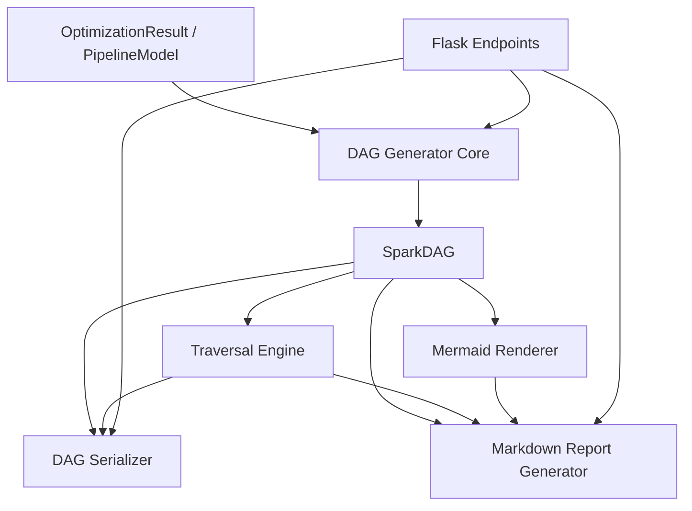

# Design Document: Spark DAG Generator

## Overview

The Spark DAG Generator transforms an optimized `PipelineModel` into a `SparkDAG` — a typed intermediate representation (IR) where each node represents a single Spark DataFrame operation and edges represent data flow. This IR is designed for consumption by a future Spark Scala code generator that walks the DAG in topological order and emits valid Spark code for each node.

The module sits between the optimizer (`src/optimizer.py`) and a future Scala code generator:

```
PipelineModel → Optimizer → OptimizationResult → DAG Generator → SparkDAG → (future) Scala Code Generator
```

Key design goals:
- Each node carries complete, self-contained metadata needed to emit one Spark statement
- The DAG is serializable to JSON for cross-language consumption
- Traversal algorithms support topological (code gen order), reverse (lineage tracing), and level-based (parallelism analysis) walks
- Mermaid rendering provides visual verification of the execution plan

## Architecture



The architecture follows the existing project pattern of pure-function modules with dataclass models:

- `src/spark_dag_models.py` — SparkNode variants, SparkEdge, SparkDAG dataclasses
- `src/spark_dag_generator.py` — Core transformation logic (PipelineModel → SparkDAG)
- `src/spark_dag_traversal.py` — Traversal algorithms (topological, reverse, level-based)
- `src/spark_dag_serializer.py` — JSON serialization/deserialization
- `src/spark_dag_renderer.py` — Mermaid rendering and Markdown report generation
- `src/app.py` — Flask endpoint additions (follows existing pattern)

## Components and Interfaces

### 1. DAG Generator Core (`src/spark_dag_generator.py`)

```python
def generate_spark_dag(model: PipelineModel) -> SparkDAG:
    """Transform a single PipelineModel into a SparkDAG."""
    ...

def generate_spark_dags(result: OptimizationResult) -> list[SparkDAG]:
    """Generate a SparkDAG for each optimized PipelineModel in the result."""
    ...
```

Decomposition logic for each DerivedDataframe type:

| DerivedDataframe Type | Generated SparkNodes |
|---|---|
| MAP (no src_filter) | SparkSelect |
| MAP (with src_filter) | SparkFilter → SparkSelect |
| JOIN (no src_a/b_filter) | SparkJoin |
| JOIN (with src_a_filter) | SparkFilter(A) → SparkJoin |
| JOIN (with src_b_filter) | SparkFilter(B) → SparkJoin |
| AGG (no sort) | SparkGroupByAgg |
| AGG (with sort) | SparkGroupByAgg → SparkSort |
| UNION | SparkUnion |

### 2. Traversal Engine (`src/spark_dag_traversal.py`)

```python
def topological_order(dag: SparkDAG) -> list[str]:
    """Return node IDs in dependency order (sources first, outputs last).
    Deterministic: nodes at same depth sorted alphabetically."""
    ...

def reverse_paths(dag: SparkDAG, output_node_id: str) -> list[list[str]]:
    """Return all paths from output back to source nodes (output first, source last)."""
    ...

def level_order(dag: SparkDAG) -> list[list[str]]:
    """Group node IDs by depth level. Level 0 = source nodes.
    Each node's level = longest path from any source to that node."""
    ...
```

### 3. DAG Serializer (`src/spark_dag_serializer.py`)

```python
def serialize_dag(dag: SparkDAG) -> dict:
    """Serialize SparkDAG to a JSON-compatible dict."""
    ...

def deserialize_dag(data: dict) -> SparkDAG:
    """Reconstruct a SparkDAG from a JSON-compatible dict."""
    ...
```

### 4. Mermaid Renderer & Markdown Report (`src/spark_dag_renderer.py`)

```python
def render_mermaid(dag: SparkDAG) -> str:
    """Generate Mermaid flowchart syntax from a SparkDAG."""
    ...

def render_markdown_report(dag: SparkDAG) -> str:
    """Generate complete Markdown document with Mermaid diagram,
    traversal order, level grouping, and node details."""
    ...
```

### 5. Flask Integration (additions to `src/app.py`)

New endpoints following the existing pattern:
- `GET /spark-dag` — Upload form
- `POST /spark-dag` — Parse, validate, optimize, generate DAG
- `GET /spark-dag/download/json` — Download serialized SparkDAG JSON
- `GET /spark-dag/download/markdown` — Download Markdown report

## Data Models

All models live in `src/spark_dag_models.py` using Python dataclasses, consistent with the existing `src/models.py` pattern.

### Design Decision: Base Class + Typed Variants

We use a base `SparkNode` dataclass with an `operation` enum discriminator and typed metadata dataclasses for each operation. This approach:
- Provides type safety — each operation's metadata is well-defined
- Enables exhaustive pattern matching in the code generator
- Keeps serialization straightforward (discriminated union on `operation` field)
- Avoids a single class with an untyped metadata dict (which would lose type safety)

```python
from dataclasses import dataclass, field
from enum import Enum
from typing import Optional


class SparkOperation(Enum):
    READ = "SparkRead"
    SELECT = "SparkSelect"
    FILTER = "SparkFilter"
    JOIN = "SparkJoin"
    UNION = "SparkUnion"
    GROUP_BY_AGG = "SparkGroupByAgg"
    SORT = "SparkSort"
    WRITE = "SparkWrite"


# --- Operation Metadata ---

@dataclass
class ReadMetadata:
    format: str  # "jdbc", "parquet", "hive"
    connection_url: Optional[str] = None
    driver: Optional[str] = None
    query: Optional[str] = None
    dbtable: Optional[str] = None
    path: Optional[str] = None
    connection_id: Optional[int] = None


@dataclass
class SelectMetadata:
    columns: list[dict]  # [{source_df, source_column, alias, expression, raw}]


@dataclass
class FilterMetadata:
    conditions: list[str]  # filter expression strings


@dataclass
class JoinMetadata:
    join_type: str  # "inner", "left"
    left_input_id: str
    right_input_id: str
    conditions: list[str]  # join expression strings
    conditions_or: list[str] = field(default_factory=list)


@dataclass
class UnionMetadata:
    left_input_id: str
    right_input_id: str
    left_columns: list[dict]  # column mappings for left side
    right_columns: list[dict]  # column mappings for right side


@dataclass
class GroupByAggMetadata:
    group_by_columns: list[str]
    aggregations: list[str]  # aggregation expression strings


@dataclass
class SortMetadata:
    columns: list[dict]  # [{column, descending: bool}]


@dataclass
class WriteMetadata:
    format: str  # "jdbc", "parquet"
    table_name: Optional[str] = None
    path: Optional[str] = None
    mode: Optional[str] = None
    batchsize: Optional[int] = None
    connection_url: Optional[str] = None
    driver: Optional[str] = None
    connection_id: Optional[int] = None


# --- Core DAG Models ---

MetadataType = (
    ReadMetadata | SelectMetadata | FilterMetadata | JoinMetadata |
    UnionMetadata | GroupByAggMetadata | SortMetadata | WriteMetadata
)


@dataclass
class SparkNode:
    id: str
    operation: SparkOperation
    metadata: MetadataType
    source_df_name: Optional[str] = None  # logical DF name for code gen


class EdgeType(Enum):
    FEEDS = "feeds"
    JOINS_LEFT = "joins_left"
    JOINS_RIGHT = "joins_right"
    UNIONS_LEFT = "unions_left"
    UNIONS_RIGHT = "unions_right"


@dataclass
class SparkEdge:
    from_node_id: str
    to_node_id: str
    edge_type: EdgeType


@dataclass
class SparkDAG:
    pipeline_name: str
    nodes: list[SparkNode] = field(default_factory=list)
    edges: list[SparkEdge] = field(default_factory=list)

    def get_node(self, node_id: str) -> Optional[SparkNode]:
        """Retrieve a node by ID."""
        return next((n for n in self.nodes if n.id == node_id), None)

    def get_children(self, node_id: str) -> list[str]:
        """Get IDs of all direct children of a node."""
        return [e.to_node_id for e in self.edges if e.from_node_id == node_id]

    def get_parents(self, node_id: str) -> list[str]:
        """Get IDs of all direct parents of a node."""
        return [e.from_node_id for e in self.edges if e.to_node_id == node_id]
```

### JSON Schema (Serialized DAG)

The serialized JSON structure that a Scala code generator would consume:

```json
{
  "pipeline_name": "ap_aging_complex",
  "nodes": [
    {
      "id": "read:oracle_invoices_df",
      "operation": "SparkRead",
      "source_df_name": "oracle_invoices_df",
      "metadata": {
        "format": "jdbc",
        "connection_url": "jdbc:oracle:thin:@localhost:1521/XEPDB1",
        "driver": "oracle.jdbc.OracleDriver",
        "query": "SELECT ...",
        "connection_id": 57
      }
    },
    {
      "id": "filter:invoice_base_df",
      "operation": "SparkFilter",
      "source_df_name": "invoice_base_df_filtered",
      "metadata": {
        "conditions": ["oracle_invoices_df.invoice_amount > oracle_invoices_df.paid_amount"]
      }
    }
  ],
  "edges": [
    {
      "from_node_id": "read:oracle_invoices_df",
      "to_node_id": "filter:invoice_base_df",
      "edge_type": "feeds"
    }
  ],
  "execution_order": ["read:oracle_invoices_df", "read:mysql_vendors_df", "filter:invoice_base_df", "..."],
  "levels": {
    "0": ["read:oracle_invoices_df", "read:mysql_vendors_df"],
    "1": ["filter:invoice_base_df", "select:vendor_map_df"],
    "2": ["select:invoice_base_df", "join:ap_with_vendor_df"]
  }
}
```

### Node ID Convention

Node IDs follow the pattern `{operation_prefix}:{logical_df_name}`:
- `read:{source_df_id}` — SparkRead nodes
- `filter:{derived_df_id}` — SparkFilter nodes
- `select:{derived_df_id}` — SparkSelect nodes
- `join:{derived_df_id}` — SparkJoin nodes
- `union:{derived_df_id}` — SparkUnion nodes
- `agg:{derived_df_id}` — SparkGroupByAgg nodes
- `sort:{derived_df_id}` — SparkSort nodes
- `write:{target_id}` — SparkWrite nodes

### Decomposition Example (AP Aging Pipeline)

For the `ap_aging_complex.json` pipeline, the DAG generator produces:

```
read:oracle_invoices_df → filter:invoice_base_df → select:invoice_base_df
read:mysql_vendors_df → select:vendor_map_df
select:invoice_base_df → join:ap_with_vendor_df ← select:vendor_map_df
join:ap_with_vendor_df → agg:ap_aging_summary_df → sort:ap_aging_summary_df → write:4002001
```


## Correctness Properties

*A property is a characteristic or behavior that should hold true across all valid executions of a system — essentially, a formal statement about what the system should do. Properties serve as the bridge between human-readable specifications and machine-verifiable correctness guarantees.*

### Property 1: Node Uniqueness Invariant

*For any* valid PipelineModel, the generated SparkDAG shall have all node IDs unique — no two SparkNodes share the same `id` field, every node has a non-null `operation`, and every node has non-null `metadata`.

**Validates: Requirements 1.1**

### Property 2: Correct Node Generation Per Element Type

*For any* PipelineModel containing sources, derived dataframes, and outputs, each SourceDataframe produces a SparkRead node whose metadata contains the source format and connection details from the model's connections list; each MAP DerivedDataframe produces a SparkSelect node whose columns match the input column mappings; each JOIN produces a SparkJoin with correct join_type and left/right references; each UNION produces a SparkUnion with left/right references; each AGG produces a SparkGroupByAgg with matching group_by and aggregations; each DerivedDataframe with non-empty src_filter produces a SparkFilter node with those conditions; each DerivedDataframe with non-empty sort produces a SparkSort node; and each OutputTarget produces a SparkWrite node with format, table/path, and mode.

**Validates: Requirements 1.3, 1.4, 1.5, 1.6, 1.7, 1.8, 1.9, 1.10**

### Property 3: Filter Insertion Pattern

*For any* DerivedDataframe of type MAP with a non-empty `src_filter`, the generated DAG shall contain the edge pattern `source → filter → select` — that is, the SparkFilter node's only parent is the source node, and the SparkSelect node's only parent is the SparkFilter node.

**Validates: Requirements 2.2**

### Property 4: Sort Insertion Pattern

*For any* DerivedDataframe of type AGG with a non-empty `sort` list that feeds an OutputTarget, the generated DAG shall contain the edge pattern `agg → sort → write` — that is, the SparkSort node sits between the SparkGroupByAgg and the SparkWrite node.

**Validates: Requirements 2.3**

### Property 5: Multi-Input Nodes Have Exactly Two Incoming Edges

*For any* SparkJoin or SparkUnion node in a generated SparkDAG, that node shall have exactly two incoming edges (two parent nodes).

**Validates: Requirements 2.4, 2.5**

### Property 6: DAG Acyclicity

*For any* valid PipelineModel, the generated SparkDAG shall contain no cycles — topological sort always succeeds.

**Validates: Requirements 2.6**

### Property 7: Topological Order Respects Edges

*For any* generated SparkDAG, the topological order shall satisfy: for every edge (u, v) in the DAG, u appears before v in the returned order.

**Validates: Requirements 3.1**

### Property 8: Topological Order Is Deterministic

*For any* generated SparkDAG, calling `topological_order` multiple times shall always produce the same result, and nodes at the same depth level shall be sorted alphabetically by identifier.

**Validates: Requirements 3.2**

### Property 9: Reverse Paths From Output to Sources

*For any* SparkDAG and any output (SparkWrite) node, `reverse_paths` shall return a list of paths where each path starts with the output node ID and ends with a SparkRead node ID, every consecutive pair in the path is connected by an edge, and the total number of distinct paths equals the number of distinct source-to-output routes through the graph.

**Validates: Requirements 4.1, 4.2, 4.3**

### Property 10: Level Assignment Correctness

*For any* generated SparkDAG, the level-based traversal shall assign level 0 to all SparkRead nodes, assign each other node a level equal to the longest path from any SparkRead node to that node, and return levels as a contiguous sequence from 0 to max depth with every node appearing in exactly one level.

**Validates: Requirements 5.1, 5.2, 5.3**

### Property 11: Serialization Round-Trip

*For any* valid SparkDAG, serializing to JSON and then deserializing back shall produce a SparkDAG equivalent to the original (same nodes, edges, pipeline_name).

**Validates: Requirements 6.6**

### Property 12: Serialized JSON Structure

*For any* serialized SparkDAG, the JSON dict shall contain keys "nodes" (list), "edges" (list), "execution_order" (list), "levels" (dict), and "pipeline_name" (string); each node entry shall contain "id", "operation", and "metadata"; each edge entry shall contain "from_node_id", "to_node_id", and "edge_type".

**Validates: Requirements 6.1, 6.2, 6.3, 6.4, 6.5**

### Property 13: Mermaid Contains All Nodes and Edges

*For any* generated SparkDAG, the Mermaid output shall start with "graph TD", contain a labeled entry for every node (including operation type and identifier), use distinct shape syntax per operation type, and contain a labeled entry for every edge (including relationship type).

**Validates: Requirements 7.1, 7.2, 7.3, 7.4**

### Property 14: DAG Count Matches Model Count

*For any* OptimizationResult containing N optimized PipelineModels, `generate_spark_dags` shall return exactly N SparkDAGs.

**Validates: Requirements 9.1, 9.3**

### Property 15: Connection Resolution

*For any* PipelineModel with connections, the SparkRead and SparkWrite nodes in the generated DAG shall have their `connection_url` and `driver` fields populated from the matching Connection object in the model's connections list (matched by connection_id).

**Validates: Requirements 9.4**

### Property 16: Markdown Report Completeness

*For any* generated SparkDAG, the Markdown report shall contain: a Mermaid code block with the flowchart, a numbered list of nodes in topological order, a node details table listing every node's ID and operation type, and a level-based grouping section.

**Validates: Requirements 10.1, 10.2, 10.3**

## Error Handling

| Scenario | Behavior |
|---|---|
| PipelineModel with no sources | Return empty SparkDAG (no nodes, no edges) |
| DerivedDataframe references non-existent source | Raise `ValueError` with message identifying the missing source ID |
| Connection ID referenced by source/output not found in model | Raise `ValueError` identifying the missing connection ID |
| Cycle detected during topological traversal | Raise `ValueError` with IDs of nodes involved in the cycle |
| `reverse_paths` called with non-existent node ID | Raise `KeyError` with the invalid node ID |
| Invalid JSON during deserialization (missing required fields) | Raise `ValueError` with description of missing/invalid fields |
| Flask upload with invalid JSON | Return HTTP 400 with validation error list |
| Flask download before DAG generation | Return HTTP 404 with descriptive message |
| Empty file list submitted to Flask endpoint | Return HTTP 400 with "No files provided" message |

Error messages follow the existing project pattern: descriptive strings with the problematic identifier included for debugging.

## Testing Strategy

### Property-Based Testing

Library: **Hypothesis** (Python) — the standard PBT library for Python, already compatible with pytest.

Configuration:
- Minimum 100 examples per property test (`@settings(max_examples=100)`)
- Each test tagged with a comment referencing the design property
- Tag format: `# Feature: spark-dag-generator, Property {N}: {title}`

Custom Hypothesis strategies needed:
- `st_pipeline_model()` — generates valid PipelineModels with random sources, derived DFs, connections, and outputs
- `st_derived_dataframe(type)` — generates a DerivedDataframe of a specific transformation type
- `st_spark_dag()` — generates valid SparkDAGs directly (for testing traversal/serialization independently of generation)
- `st_column_mapping()` — generates random ColumnMapping instances

Each correctness property (1–16) maps to exactly one property-based test function.

### Unit Tests

Unit tests complement property tests by covering:
- Specific examples from the real pipeline JSONs (e.g., `ap_aging_complex.json` produces expected DAG structure)
- Edge cases: empty pipelines, single-node pipelines, pipelines with only sources and no derived
- Error conditions: missing connections, invalid references, cycle detection
- Flask endpoint integration: upload flow, download responses, error responses
- Mermaid syntax spot-checks against known expected output

### Test File Organization

```
tests/
  test_spark_dag_generator.py      # Property tests for generation (P1-P6, P14, P15)
  test_spark_dag_traversal.py      # Property tests for traversal (P7-P10)
  test_spark_dag_serializer.py     # Property tests for serialization (P11, P12)
  test_spark_dag_renderer.py       # Property tests for rendering (P13, P16)
  test_spark_dag_integration.py    # Unit tests with real pipeline data + Flask endpoints
```

### Test Dependencies

Add to `requirements.txt`:
```
hypothesis>=6.0
pytest>=7.0
```
